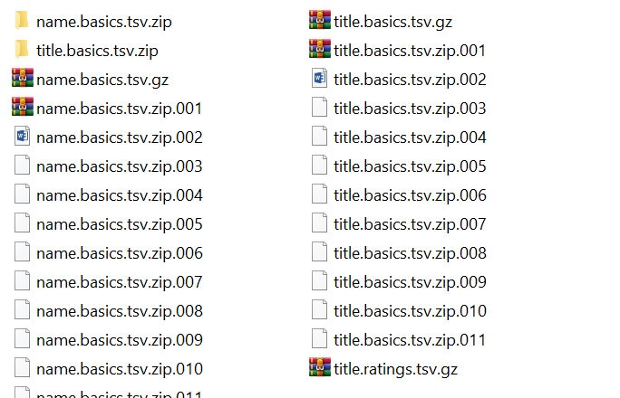

### Technologies

- **Backend**: Python with Flask Framework
- **Front-end** : Angular
- **Database**: Sqlite

### Backend

#### Installing requirements
- It is necessary to have Python installed. This can be achieved by following instructions here:  https://www.python.org/downloads/
- It is higly recommended to have installed PyPA for installing Python packages on command line. This can be achieved by following instructions here: https://pypi.org/
- Inside the folder **backend**, there is a requirements.txt file.  There, you can find all the necessary packages and its versions to run the backend properly. A faster installion would be running the command **pip install -r requirements.txt** .

__Important:__ depending on your system, make sure to use `pip3` and `python3` instead.


#### Design
+ The backend has 4 files only:
	* **routes.py**:  Where all the endpoints of REST API are registered and responses are processed.
	* **models.py**:  Where the classes that represents the model used for the database used through all the application. It is where the command that reads the zipped files, filters data and creates the database populated .
	* **implementations.py**: Where there are all the methods that finds the data requested on routes.py.
	* **init.py**: Inside app folder, it is the file that creates the Flask app and its context through the whole project. It uses the design pattern **Factory** to instantiate the app.

#### Running
- Go to backend/app and on command line type (Windows):
`set FLASK_APP=routes.py`

- Or Linux
`$env:FLASK_APP = "routes.py"`

- Then move to parent folder and type:
`flask run `

- The backend is already running!

#### Endpoints
- **/api/movies [GET]**
	- Requested param is **page**, otherwise it will return a message error.
	- Params **search** and **filterBy** might be passed as well. If they are not, the method set **filterBy** as **primaryTitle**.
	- It searches movies based on the params. The results are paginated.

- **/api/movies/by-year [GET]** 
	- Requested param is **page**, otherwise it will return a message error.
	- Param year should be passed as well. If it is not,  the method searches for the all movies paginated ordered by ratings.
	- It searches top movies by year based on the year. The results are paginated.

- **/api/movies/names [GET]** 
	- Requested param is **tconst**, otherwise it will return an empty result.
	- It searches the names related to the tconst title. The results are paginated.

### Database

- As said before, the schema was created based on the classes described on file **models.py**.
- There are only two tables: **Title** and **Name**.
- **Title** represents the data stored on file **title.basic.tsv.gz** merged with file **title.ratings.tsv.gz"**.
-  **Name** represents the data stored on file **name.basics.tsv.gz".

```python
	class Title(db.Model):
		id = db.Column(db.Integer, primary_key=True)
		tconst = db.Column(db.String(80), unique=True, nullable=False)
		titleType = db.Column(db.String(80), unique=False, nullable=False)
		primaryTitle = db.Column(db.String(80), unique=False, nullable=False)
		originalTitle = db.Column(db.String(80), unique=False, nullable=False)
		isAdult = db.Column(db.Boolean, default=False)
		startYear = db.Column(db.Integer, unique=False, nullable=False)
		endYear = db.Column(db.Integer, unique=False, nullable=False)
		runtimeMinutes = db.Column(db.Integer, unique=False, nullable=False)
		genres = db.Column(db.String(80), unique=False, nullable=False)
		averageRating = db.Column(db.Float, unique=False, nullable=False)
		numVotes = db.Column(db.Integer, unique=False, nullable=False)


	class Name(db.Model):
		id = db.Column(db.Integer, primary_key=True)
		primaryName = db.Column(db.String(80), unique=False, nullable=False)
		birthYear = db.Column(db.Integer, unique=False, nullable=False)
		deathYear = db.Column(db.Integer, unique=False, nullable=False)
		knownForTitles = db.Column(db.String(80), unique=False, nullable=False)
```

- The primaryProfession and nconst fields on file **name.basics.tsv.gz** was removed because it would be a parameter of searching on REST API and it would help reduce the database size.

- To create database, it is necessary first to folowing the instructions above of running the backend. Then, at another terminal, type ate folder "backend":
`flask init-db`

- During the process, the application filters the data inside the files. It is done using the package **Pandas**. All null values are removed, data out of pattern are dimissed, title with rating less than 6 are removed.

- It might take some time to complete the task, but at the application should create a file inside backend folder called **movies.db**

__Important:__:  It is necessary to unzip the files **titles.basics.tsv.zip.001** and **name.basics.tsv.zip.001** , copy the **.gz**  files inside, and paste on the root of **dataset** folder, otherwise it won't be posible to create the database. 



### Front-end

- The front-end project was created using **Angular CLI**.
- First all, **Node.js** it is required so later we can install the packages we need and mainly, run the app. Follow instructions: https://nodejs.org/en/download/.
- It is necessary to have it installed to run the app. Follow instructions here:  https://angular.io/cli.
- Inside movie-app folder, run:
`npm install`

- It will check the packages on file packages.json and install locally the packages (**Bootstrap, NGXPagination**) inside the project.
- There are 3 components here: movie-finder, header-bar and casting-box;
	Casting-box: component that represent the box where the data of names related to the title wil show on its movie card
	Header-bar: just a component to separate the toolbar on top from the main component code
	Movie-finder: where the search is actually done. It gives the option to search the movie by title, genre, top ratings or search the top movies of the year. The main screen shows 4 movies cards with its data inside per page and result are always paginated.
- To run the app, just type inside movie-app:
	 `ng serve`
- Open the browser on **localhost:4200**
- When results are shown, there it will be a small box below of every card with the title **Casting and Crew** and a green search button on right side. It is because the names are not loaded when the movie is found, it is needed to click on the green button and then the application will the list the names of people enrolled on that movie.
- For running tests: `ng test`.